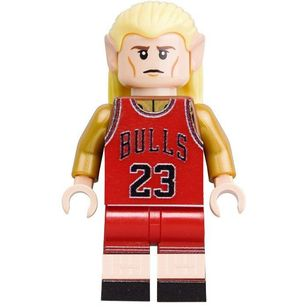
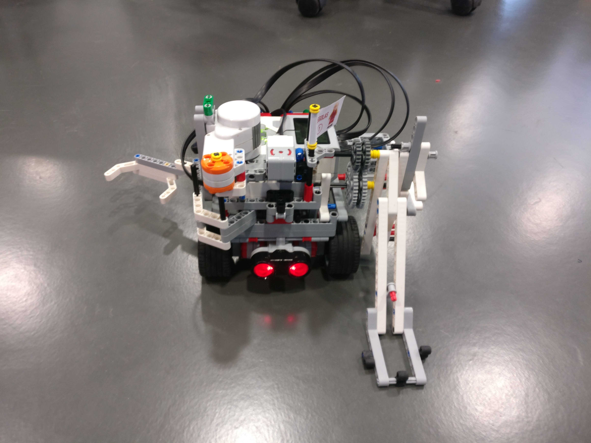
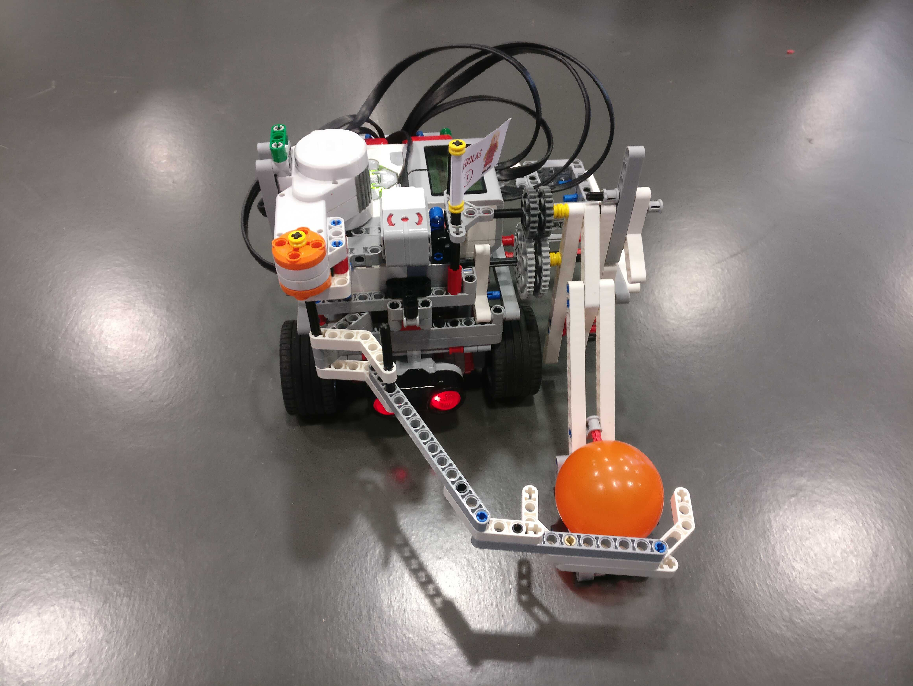
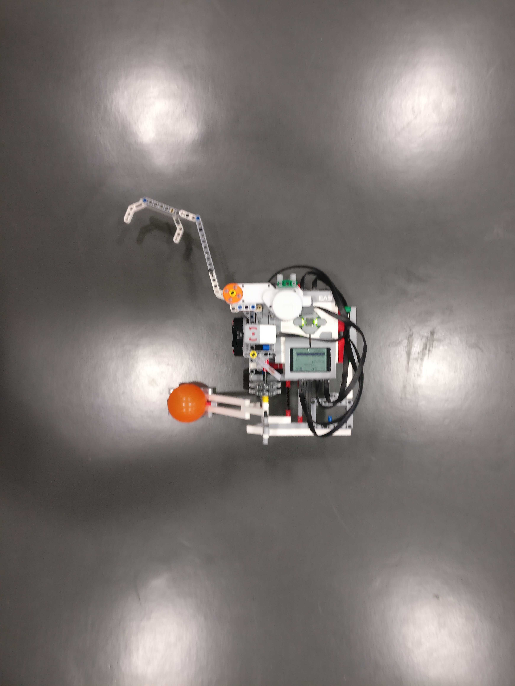
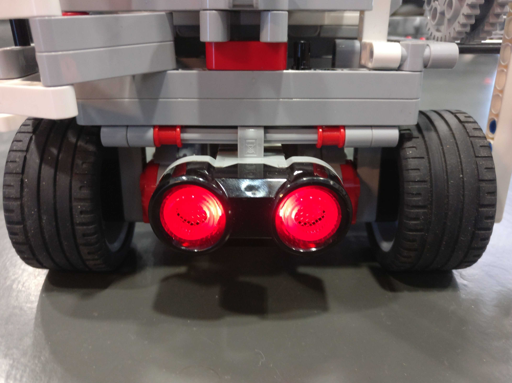
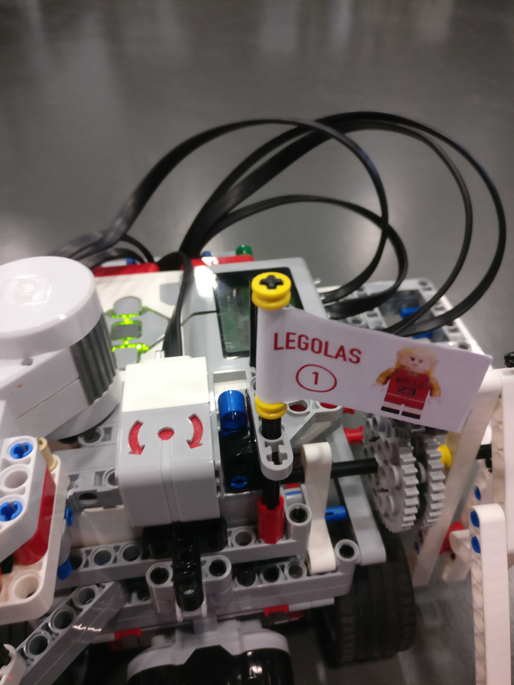
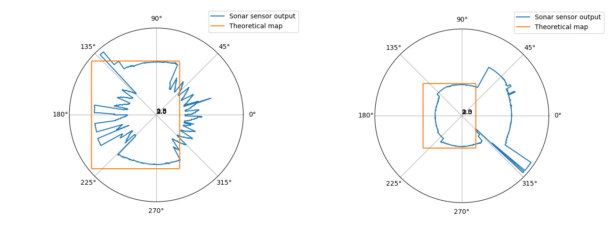
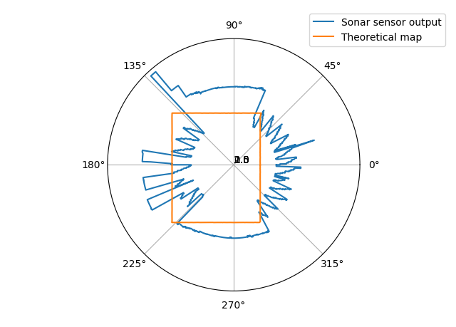
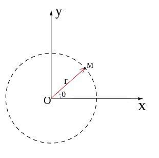

# LEGOlas : Group 1 ev3 Robot Project



This robot project was made in the context of the [OS EURECOM course](http://soc.eurecom.fr/OS). The goal of the project was to build an ev3 LEGO programmable robot that can play a "basketball" game in a pre-built field. All the rules and specifications of the field can be found on the [OS website](http://soc.eurecom.fr/OS/projects_fall2018.html).

## Our proposal

### Mechanical design

The final design of our robot looks as so :





The robot complies to the given [specifications](http://soc.eurecom.fr/OS/projects_fall2018.html#specification) :
 * Its dimensions are 21cm × 22cm × 30cm when folded, and 31cm × 24cm × 18cm when unfolded
 * The robot uses four tacho engines :
   * Two for the wheels
   * One for the catapult arm
   * One for the "ball-grabbing", i.e. an arm
 * The robot communicates over bluetooth in a reliable way
 * The robot fits into a 35cm wide cube at the start of the game by "folding" its arms (catapult and grabbing arm)
 * It doesn't use any destructive weapon, only the elements inside the LEGO box
 * Robot is fully autonomous as soon as the game starts
 
 To be able to move and to find a ball on the field, the robot uses three sensors:
 
 * EV3 Ultrasonic Sensor:
   * Principle: it generates sound waves and reads their echoes to detect and measure distance from objects
   * According to its documentation, that one can find on the [LEGO website](https://shop.lego.com/en-US/product/EV3-Ultrasonic-Sensor-45504), this sensor should measure distance the between itself and an object far from 250cm maximum. Unfortunately, the experience showed us that when a ball was too close from the robot, the sensor did not return the corresponding distance, and we were therefore unfit to detect the ball. 
   * Position on the robot: very close from the floor, and parallel to it, as one can see on the image below
   * We used this sensor to detect the ball on the field, and more particularly to get its distance from the robot, to be able to move toward it and to catch it.

 
 
 * EV3 Gyro Sensor:
   * Principle: it measures the robot’s rotational motion and changes in its orientation
   * According to the documentation that on can find on the [LEGO website](https://shop.lego.com/en-CA/product/EV3-Gyro-Sensor-45505), the angle mode measures angles with an accuracy of +/- 3 degrees. It was enough for us in order to be able to turn the robot through a given angle. 
   * Position on the robot: centered and horizontal, in order to be able to measure the rotation around the perpendicular angle.

 


## Algorithms 

### Find a ball: the scan

#### Our first idea

The first idea for the scan was a rather simple idea. The sonar sensor returns a value in millimeter corresponding to the distance between the sensor and the first object the sound wave reflects on.

Based on the idea that the sensor would give a reasonable and correct output, the first scan was declaring that the ball was found if it found any object closer than a fixed distance. The robot will then turn on itself and proceed to a scan until he founds something. If it finds nothing, it stops at the input angle.

We had to separate the algorithm in order to permanently retrieve the sensor values and at the same time moving the robot. Separating in a thread allowed us to make the robot move as we wanted.

That would give the pseudo code below :

```
algorithm scan is
    input: A fixed radius (the maximum distance) R
    	   An angle A
    output : a couple (angle, distance)

    create global variable notFinished
	create the sensor value thread and pass the parameters A and R
	while (notFinished):
		control the robot in a certain way
	
	stop the robot

	return (angle, radius)

sensor thread is
	while (current angle < A and current sonar distance > R):
		store the current values in two variables
	notFinished = 0
	
	if current angle has reached A:
		return angle of 0 and radius of 0 to main thread
	else:
		return current angle and radius to main thread
```
#### Our second idea

The first idea had two major defects, firstly the scan cone was sometimes too wide and so the robot found the ball at a considerably large offset angle. The second defect was that the actual values of the sonar sensor were so different from the theoretical ones. As a solution for the first problem we decided to compute the mean of two relevant positions (meaning that correspond to the same ball). In order to do that we use the following strategy : our new scan consists of turning 360 degrees in relatively positive direction, then once it detects a "ball" it ignores all angle values that follow until the end of the 360 turn. Then it turns in the negative direction ignoring all obstacles that could potentially be in the previously ignored zone minus 30 degrees. Two positions are considered close if the difference between the distances at which they were detected is negligible. This allows us to find the ball in a more reliable way.

To counter the second problem, we wanted to move around the field and try to cover as much of the field as possible. However, because of the uncertainty of the position and of the imprecision of the sonar sensor, we gave up on that idea especially that moving around too much requires calibrating all the time and it wouldn't be that beneficial in games that would last 4 minutes to spend much time on that. So we decided to adopt the following strategy.

**Aim at a lower distance, but with more confidence :**

The scanning was a tough part of the project. The imprecision of the sensor lead us to aim at a lower distance, but also to optimize the scanning area based on the **real output** of the sensor.

Let us first show the output of the sonar sensor without any ball and a robot on the other field. We placed the robot at its initial position (inside the square) and printed the output on the terminal. Sami coded a function that, for any given angle, will output the **theoretical** radius (i.e. the distance between an object and the robot), here being the shape of the field : a rectangle.

Here are the plotting results (made with a simple python script) :



Before getting the real output of the sensor we first thought of simply putting as a condition of finding the ball, finding a sonar value that is smaller than the theoretical radius computed by the function that we coded for it, give or take a few centimeters. Here is what the final scanning looked like :



But the problem was that, the real output didn't even have the shape of a rectangle. So we narrowed our scan to a much smaller rectangle that fits inside most of the graphs that we generated with the real output of the sensor. Making it a lot more reliable, but it still wasn't enough so we eventually decided to scan from a few relevant positions.  

### The bluetooth threads

The bluetooth core functions were established by Matteo Bertolino and the bluetooth repository can be found [here](https://gitlab.eurecom.fr/ludovic.apvrille/OS_Robot_Project_Fall2018).

The bluetooth was implemented thanks to threads. Threads allow to execute instructions while the robot is running. The bluetooth design can be described as followed :
 1. Initiate the bluetooth connection from the main thread and create two threads
 1. A thread will permanently run in order to get messages from the server :
    * When receiving `MSG_START`, it unlocks the robot and the robot can proceed to a given strategy
    * When receiving `MSG_STOP` or `MSG_KICK`, the robot stops and exits
 1. A thread runs and waits to be woken up. It used a mutex and a condition variable. The main thread can execute `send_score(int score)` and the thread will wake up and the the corresponding score to the server. When finished, it goes back to sleep.

 All the functions and thread routines can be found in `source/client.c`.


### Move toward the ball

These algorithms have been written by Yasmine Bennani.
First, I implemented only the *move_forward* and the *turn* functions. Therefore, the robot was able to move forward a given distance in centimeter, and to turn through a given angle. But it was then troublesome to know exactly which distance should be runned during the explore state (the state during which the robot explores the field in order to find a ball). Moreover, the path taken by the robot was not optimized, because we had to tell him to turn then to move many times.
Thus I decided to implement a dead reckoning algorithm. Dead reckoning refers as the process in navigation of calculating one's current position by using a previously known position. This algorithm's aim was to konw at each time the position of the robot, so it never crosses the field's frontiers for instance. I was then able to implement a *move_to_xy* function to tell the robot to move at a given position on the map, which was way more efficient.

```
algorithm move_forward is
    input: A distance dist in centimeter (if negative, the robot move backward)
    output: No output
    
    search for the two tachos at port 66 and port 67 (corresponding tachos for the left and the right wheels)
    if found:
        get max_speed of one tacho
        get count_per_rot of one tacho ( = the number of counts in one rotation of the tacho)
        
        sign_dist = abs(dist)/dist (Get the sign of dist to know if the robot has to move forward or backward)
        speed = sign_dist * max_speed * 1/3
        set left_tacho_speed and right_tacho_speed to speed
        
        (Compute the time the robot should run to cross dist cm)
        time_to_run = (count_per_rot * dist )/(max_speed * 1/3 * PI * WHEEL_DIAM) (WHEEL_DIAM & PI are global variables)
        RUN_TIMED both tachos for time_to_run seconds
        STOP left_tacho and right_tacho
```

```
(Thread, to know at each time the current position of the robot)

struct current_position {
    x,
    y,
    theta,  
    state (RUN_FOREVER, RUN_TIMED, STOP, ...)
}

algorithm dead_reckoning is
    input: No input
    output: No output
    
    search for the two tachos at port 66 and port 67 (corresponding tachos for the left and the right wheels)
    if found:
        while 1:
            get left_tacho_speed and right_tacho_speed
            count_per_rot = get tacho count per rot
            if( left_tacho_speed == - right_tacho_speed): (Then the robot is turning)
                current_position.x = current_position.x
                current_position.y = current_position.y
                (And theta is updated at the end of the *turn* function)
            
            else:
                while (left_tacho_speed == right_tacho_speed && current_position.state != STOP): (The robot is moving in a straight line)
                    sign_speed = abs(left_tacho_speed)/left_tacho_speed
                    theta = current_position.theta
                    ( Distance runned in CLOCK_PER seconds : inverse calculation as in move_forward)
                    dist = sign_speed * (CLOCK_PER * left_tacho_speed * PI * WHEEL_DIAM ) / count_per_rot 
                    
                    if(theta <= 90):
                        current_position.x += dist * cos((theta*PI)/180)
                        current_position.y += dist * sin((theta*PI)/180)
            
                    else if ( 90 <= theta && theta <= 180)
                        current_position.x -= dist * sin((theta*PI)/180 - PI/2)
                        current_position.y += dist * cos((theta*PI)/180 - PI/2)
                    
                    else if ( 180 <= theta && theta <= 270)
                        current_position.x -= dist * cos((theta*PI)/180 - PI)
                        current_position.y -= dist * sin((theta*PI)/180 - PI)
                    
                    else if(theta > 270)
                        current_position.x += dist * cos(2*PI - (theta*PI)/180)
                        current_position.y += dist * sin(2*PI - (theta*PI)/180)

                    sleep for CLOCK_PER seconds
                    get left_tacho_speed and right_tacho_speed
                    
                    if(abs(current_position.x) > FIELD_WIDTH / 2 || abs(current_position.y) > FIELD_LENGTH / 2): (if the robot crosses the frontier of the field)
                        current_position.state = STOP
                        STOP left and right TACHOS
                        
            Sleep for 10 mseconds
```

```
algorithm turn is
    input: An angle angle in degrees
    output: 0 if error 1 otherwise
    
    search for EV3_GYRO_SENSOR
    if found: init = get_sensor_value (give us the orientation of the robot at the beginning of the function)
    else: return 0
        
    search for the two tachos at port 66 and port 67 (corresponding tachos for the left and the right wheels)
    if found:
        get max_speed of one tacho
        speed = 1/40 * max_speed
        sign = abs(angle)/angle (Get the sign of the angle to know in which direction the robot should turn)
        set left_tacho_speed to sign_angle * speed 
        set right_tacho_speed to - sign_angle * speed
        
        RUN_FOREVER left_tacho and right_tacho
        
        value = get_sensor_value
        while sign_angle * (float)(((int)value - ((int)angle  + (int)init)) % 360) != 0.0:
            value = get_sensor_value
            
        STOP left_tacho and right_tacho
        
        current_position.theta = current_position.theta - angle (Update the orientation of the robot)
        current_position.theta = current_position.theta % 360 (Keep it between 0 and 360)
        return 1
        
    else: return 0
```

```
algorithm move_to_xy is
    input: x and y, the coordinates of the position we want to reach
    output: No output
    
    search for the two tachos at port 66 and port 67 (corresponding tachos for the left and the right wheels)
    if found:
        x0 = current_position.x, y0 = current_postion.y
        dist = sqrt((x-x0)**2 + (y-y0)**2)  (Calculate the distance to be travelled)
        
        (Calculate the angle to be turned)
        if( x > x0 and y > y0)
            cos_theta = (y - y0)/dist, sin_theta = (x - x0)/dist
            theta = atan(sin_theta/cos_theta)
        
        else if( x < x0 and y < y0)
            cos_theta = (x0 - x)/dist, sin_theta = (y0 - y)/dist
            theta = atan(sin_theta/cos_theta) + PI/2
        
        else if( x < x0 and y > y0)
            cos_theta = (y - y0)/dist, sin_theta = (x0 - x)/dist
            theta = atan(sin_theta/cos_theta)
        
        else if (x > x0 and y < y0)
            cos_theta = (x - x0)/dist, sin_theta = (y0 - y)/dist
            theta = atan(sin_theta/cos_theta) + PI/2
            
        angle = current_position.theta - 90 (The difference  between the current direction and the beginning direction (90°))
        if(angle > 180): angle = 180 - angle
        if(x0 < x): turn through theta - angle (First convert theta in degrees)
        else: turn through -(theta - angle) (Idem)
        
        RUN_FOREVER left_tacho and right_tacho
        current_position.state = RUN_FOREVER
        ( Move until the robot has reached his destination)
        while( x != x0 and y0 != y and current_postion.state != STOP):
            x0 = current_position.x, y0 = current_position.y
    
        STOP left_tacho and right_tacho
```

### Catch and throw the ball

Our robot structure is what actually dictated the right functions/mecanisms to catch and throw the ball. But it was also convenient to move around with the hand and the catapult at certain positions. So we decided to implement different functions for all these functionalities. All functions are basically turning the right corresponding motor for a certain period of time that we chose based on many experiments.  

## Our strategy to win

We have two strategies, depending on our opponent. As we are able to throw to balls very fast in the basket, at the very beginning of the game, we could just score two baskets, and then disturb the opponent in his field and prevent him from scoring. So, here are our strategies:

* If the opponent can just score one basket at the beginning of the game, or if he can just drop his balls in the basket and not throw them:
First we score two baskets at the beginning by throwing the balls from the distant area. Therefore we have already 6 points when are opponent has at the most 3 points. Then, we cross our frontiers to get to their side of the field, in order to prevent them from looking for their ball and/or scoring another basket. When we cross the field we loose a point, but we are still at 5 vs 3 : **we win**

* If the opponent can also score two baskets from the distant area at the beginning of the game:
First we score two baskets from the distant area: we have 6 points, but so they have. This time we do not cross the frontiers, but we explore our field to find another ball. If our opponent choose to come to our side of the field, they loose one point, so even if we don't find a ball, **we win**. If they also choose to explore their field, three situations could occur:
    * We find a ball and score a basket from the distant area and they don't : 9 vs 6, so **we win**
    * They find a ball and score a basket from the distant area but we don't: 6 vs 9, we loose...
    * No one is able to find a ball, the time elapsed, 6 vs 6, **draw**
 

## Source code

### Installation and usage

* How to compile the source code:

    The Makefile should compile and link every files together in the `main` executable. But note that :
    * You must compile the source code either in the robot itself or in an ev3 docker. Instructions to configure the docker can be found on the [OS website](http://soc.eurecom.fr/OS/projects_fall2018.html#cross).
    * You will probably have to clone the [ev3dev-c](https://github.com/in4lio/ev3dev-c), as it is not cloned when cloning our repository. This repository contains all the required librairies in order to command the robot.
    * You must install the `libbluetooth-dev` package either on the docker or robot in order to communicate with the [server](https://gitlab.eurecom.fr/ludovic.apvrille/OS_Robot_Project_Fall2018/tree/master/server).
* How to download it on the robot:

    If you compiled the executable on a docker, you must copy over ssh the `main` executable via scp. Instructions to setup ssh with the robot can be found on the [ev3 website](https://www.ev3dev.org/docs/tutorials/connecting-to-ev3dev-with-ssh/)
* How to start the robot:

    To start the robot, you can either execute `main` via ssh (bluetooth or wired connection) or navigate into the robot's File Browser and simply press the `main*` executable. 

## Some videos

<div style="padding:56.25% 0 0 0;position:relative;"><iframe src="https://player.vimeo.com/video/312700066" style="position:absolute;top:0;left:0;width:100%;height:100%;" frameborder="0" webkitallowfullscreen mozallowfullscreen allowfullscreen></iframe></div><script src="https://player.vimeo.com/api/player.js"></script>
<p><a href="https://vimeo.com/312700066">Robot demo</a> from <a href="https://vimeo.com/user94194007">Antonin Godard</a> on <a href="https://vimeo.com">Vimeo</a>.</p>

## The team

### Sami AAZMI

Sami was in charge of the construction of the robot: we discussed all together for a long time about the "design" of our robot, and about how to efficiently and reliably catch and throw a ball. Sami constructed a considerable amount of  prototypes of the hand/catapult design, while always focusing on the balance and the compactness of the robot as a whole, which eventually made its architecture strong and reliable. He also placed the sensors at the most convenient positions to have the best results possible.

He also implemented the functions that activate the arm and the catapult.
Moreover he worked with Antonin on the second version of the *scan* function.

### Antonin Godard

Antonin was in charge of the Bluetooth connection between the robot and the server, the git management, the compilation (Makefile, headers, etc.) and the scanning function. He implemented two versions of the scan, one coded by himself, and the final one in collaboration with Sami.

Antonin helped Yasmine to integrate the various functions in the main routine and helped writing the website.

### Yasmine Bennani

I was in charge of the movements of the tachos. I implemented the different functions that make the robot move and turn, such as *move_forward*, ¨move_to_xy* or *turn*.
I also took in charge of the system integration for each evaluation (for th 18th December and then for the 22th January).

For the 18th December, the system integration highlighted the fact that moving the robot with only the *move_forward(dist)* and the *turn(angle)* functions was troublesome. Indeed, in order to explore the whole field, we wanted to place the robot at each corner of the field in a row, so moving from one to another took a lot of time of determining the right distance to be runned. Moreover, when it has found a ball, it was hard to know exactly where the robot was exactly on the field to tell him to go to the **shoot position**, which is the **init position**.

Therefore, after this evaluation, I implemented my own version of the **dead reckoning** process. I was researching a way to be able to know the position of the robot at each time, like a GPS, when I found this kind of process used in navigation. Knowing the current position, this algorithm calculates nonstop the new position, as long as the wheels are running, i.e. as long as the robot position is changing. Thus I made a thread, which tests if the robot is moving, and if it is, the thread updates its position (x,y and its orientation theta). The field is considered as follow: 

 

Thanks to this thread, I was then able to implement a *move_to_xy* function, to tell the robot to move from its current position to another one defined by its coordinates x, y. As the robot is oriented, this function has to calculte first the angle that need to be turned in order to be in the right direction, and then calculates the distance that to be runned. The thread updates in the backgroud the robot coordinates and orientation.

I also wrote with the contribution of Antonin this Markdown, to document our project and our proposal for this basketball playing robot.


